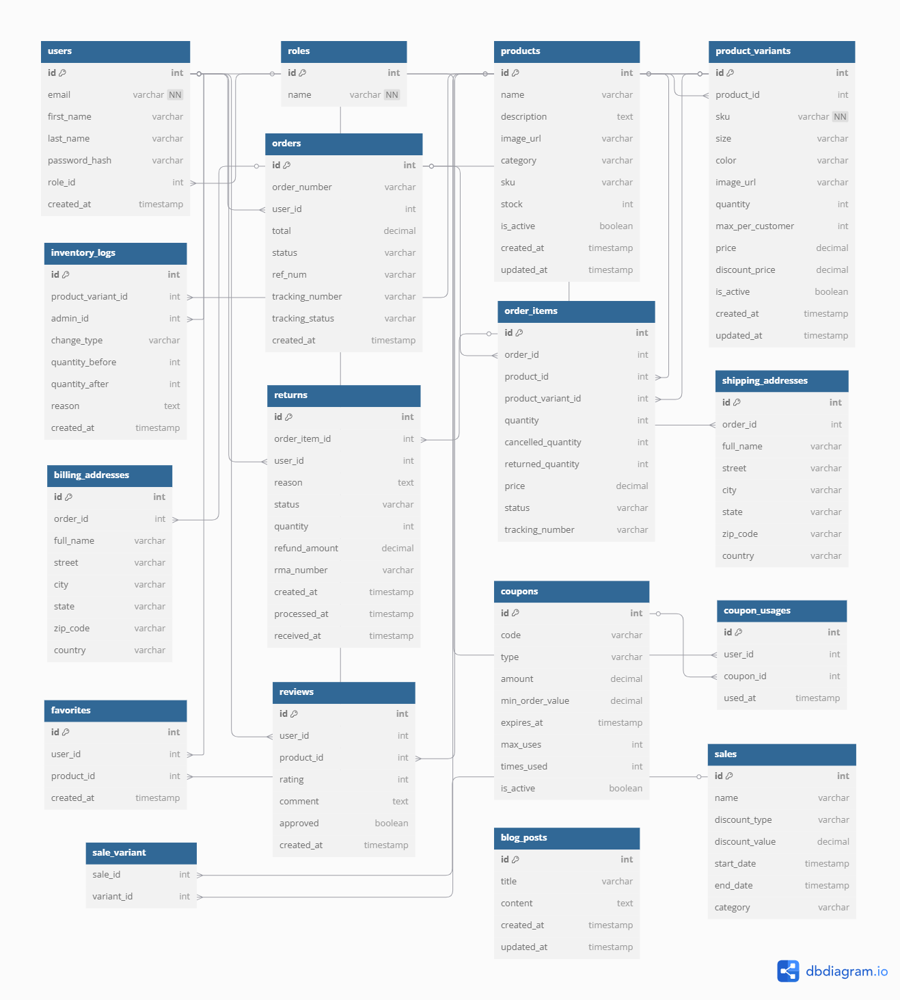

# Sun-Kissed & Southern 🌞🌴  
*Capstone Project Proposal*

## 🧰 Tech Stack

- **Backend**: Python Flask (REST API)
- **Frontend**: React (Vite + JSX)
- **Database**: PostgreSQL
- **Deployment**: Render (backend), Netlify (frontend)
- **APIs**:
  - [Cardknox API](https://docs.cardknox.com/api/transaction) – Payment processing (sandbox)
  - Optional: [KD100/KeyDelivery API](https://www.kd100.com/docs/create-tracking) – Shipment tracking
  - [OpenWeatherMap API](https://openweathermap.org/api) – Weather snippets for blog

## 🔄 Project Focus

A full-stack ecommerce platform focused on clean design, responsive UX, and a robust backend capable of handling complex order/fulfillment logic.

## 🌐 App Type

Responsive ecommerce site (mobile + desktop) for a Florida beach lifestyle brand.

## 🎯 Project Goals

Deploy a functional store with:

- Product catalog w/ variants (size/color/stock)
- Customer accounts + order tracking
- Discount codes and sales logic
- Admin dashboard: inventory, returns, fulfillment
- Blog with lifestyle content

## 👩 Target Users

Women aged 25–45, interested in Florida/country-inspired fashion and beach life. Familiar with online shopping and mobile-first experiences.

## 📊 Data & APIs

- PostgreSQL for all persistent data (users, orders, reviews, etc.)
- Cardknox for secure sandbox payments
- KD100 for shipping tracking (optional, can be manual entry)
- Optional OpenWeatherMap to personalize blog content

## 🧩 App Functionality

- Auth: Register/login (JWT), localStorage token persistence
- Product listings by category
- Product variants (SKU, price, size, color, quantity)
- Shopping cart (frontend/localStorage)
- Checkout (Cardknox)
- Coupon and promo code validation
- Admin tools: CRUD for products, variants, users, returns
- Order fulfillment (mark as fulfilled, shipped, returned)
- Blog CMS
- Review system (with moderation)
- Favorites (wishlist-style)

## 💡 Features Beyond CRUD

- Variant-level inventory management
- Item-level order status: paid → fulfilled → shipped
- Discount logic: sales + coupons (fixed/percent)
- Product review moderation
- Return and refund workflow w/ optional inventory restock
- Tracking numbers assigned per item
- Admin-facing analytics + inventory logs
- Responsive modular UI styling with scoped CSS

## 🧭 User Flow

1. User browses → selects variant → adds to cart
2. Cart saves in localStorage (guest or logged in)
3. Login/signup before checkout if needed
4. Cardknox payment processing → order placed
5. User sees order confirmation + tracking
6. Admins manage inventory, fulfill orders, review returns

## 🛡️ Security & API Handling

- Cardknox keys in `.env`
- JWT tokens for auth with role-based access (admin, customer_service, etc.)
- Optional tracking fallback if KD100 fails
- Secure endpoint protection + role filtering

## 🚀 Stretch Goals

- Saved payment method (via Cardknox tokenization)
- SMS/email order notifications
- Image uploader for admin panel
- Public-facing sales pages (like blog posts)

## 🗺️ Timeline (Adjusted)

- **Week 1**: Backend setup (models, routes, DB), React/Vite scaffolding
- **Week 2**: Auth, product logic, cart, checkout, admin dashboard
- **Week 3**: Coupon/discount logic, fulfillment/returns, blog CMS
- **Week 4**: UI polish, responsive styling, deployment, testing

## 📁 Database Schema

📌 View the live schema:  
👉 [https://dbdiagram.io/d/Sun-Kissed-and-Southern-67d1b7cf75d75cc844d787ff](https://dbdiagram.io/d/Sun-Kissed-and-Southern-67d1b7cf75d75cc844d787ff)

📸 Visual Schema:

---

