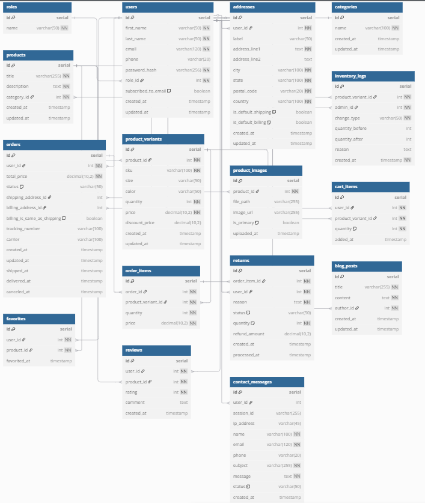

# Sun-Kissed & Southern ☀️🌴

Welcome to **Sun-Kissed & Southern**, a full-stack ecommerce platform built as a capstone project for Springboard. Inspired by the Florida coast, this boutique beach lifestyle store simulates a real-world shopping experience with secure payments, dynamic product variants, order tracking, and full admin tools.

---

## 🛍️ Features

- ✅ Browse and filter products by category
- ✅ Product variants with color, size, price, image, and inventory
- ✅ Sale prices and fixed/percent coupon code support
- ✅ Guest cart stored via localStorage (no login required)
- ✅ Secure checkout with **Cardknox API (sandbox mode)**
- ✅ Order tracking UI (manual entry; KD100-ready)
- ✅ Admin dashboard for:
  - Product and variant management
  - User moderation and analytics
  - Order fulfillment (paid → fulfilled → shipped)
  - Return and refund flow with optional restock
  - Blog CMS with lifestyle content
- ✅ Reviews (moderated) and favorites (wishlist-style)
- ✅ Mobile-first design with scoped CSS and interactive UI (e.g., zoom on hover)

---

## 🧰 Tech Stack

### Frontend
- React (Vite)
- React Router, Context API
- Scoped CSS for modular, responsive styling
- Toast notifications, modal forms, dropdowns, and paginated UI

### Backend
- Python Flask (REST API)
- PostgreSQL + SQLAlchemy ORM
- JWT Authentication + role-based access control
- Flask-Migrate, Marshmallow, environment configs

### APIs Used
- [Cardknox](https://developer.cardknox.com/) — **sandbox payment processing**
- [KeyDelivery](https://www.kd100.com/en/) — (optional) **shipping tracking**
- [OpenWeatherMap](https://openweathermap.org/api) — used for blog widget (optional)

---

## 🗺️ Architecture

- Frontend and backend deployed independently
  - 🔹 **Frontend**: Netlify  
  - 🔹 **Backend**: Render
- Environment variables protect secrets (e.g., Cardknox keys)
- Guest and logged-in experiences supported across routes

---

## 📦 Database Schema

View the database schema at:  
📎 [dbdiagram.io link](https://dbdiagram.io/d/Sun-Kissed-and-Southern-67d1b7cf75d75cc844d787ff)

---

## 📄 Project Proposal

The full [PROJECT_PROPOSAL.md](PROJECT_PROPOSAL.md) includes technical decisions, scope, feature map, and timeline.

---

## ✅ Status

- ✅ Checkout + coupon logic complete
- ✅ Admin dashboard polished with advanced functionality
- ✅ Blog, reviews, and favorites implemented
- 🔐 Payments and tracking simulate real-world flows (sandbox mode)

➡️ Future upgrades include live Cardknox key support, automated tracking API integration, and customer notifications via email or SMS.

---
